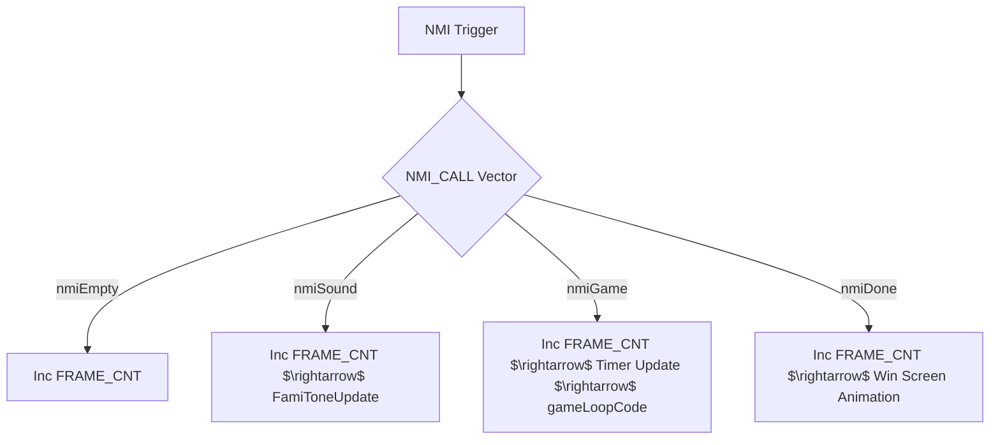
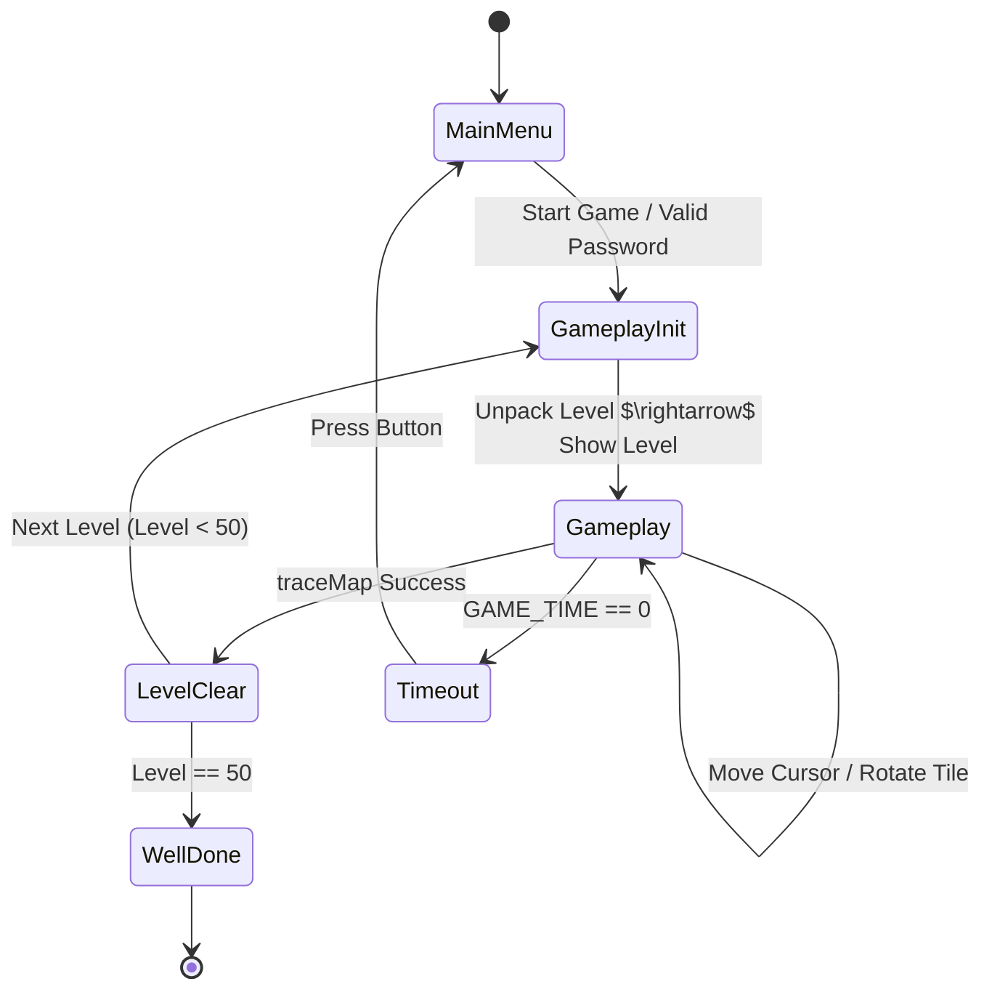

# System Overview
Lan Master is built as a state-driven application utilizing the NES's Non-Maskable Interrupt (NMI) for timing and display synchronization. The game employs a dynamic NMI handler system to switch between different operational modes (e.g., basic timing vs. full game logic).

## Execution Model (NMI-Driven)
The game logic is driven by the NMI handler. The system uses a dynamic handler mechanism where the `nmiHandlersList` (in `game.asm`) stores addresses for different modes. The `setNmiHandler` routine updates the `NMI_CALL` vector ($FA) to jump to the selected handler.

# Game State Machine
The game transitions through states managed primarily in `game.asm`.

# Component Architecture

## 1. Core Logic (`game.asm`)
- **`gameLoopCode`**: The primary per-frame logic:
    1. **Visuals**: Updates OAM and adjusts palette/colors for the current column.
    2. **Rotations**: Handles manual tile rotation and automatic random rotations (`randomRotateTile`).
    3. **Terminals**: Updates the visual state of terminals (`updateTerminals`).
    4. **Status**: Updates the "Online" count for the display.
    5. **Input**: Polls gamepad via `padPoll` to move cursor or trigger rotations.
    6. **Connectivity**: Periodic calls to `traceMap` (every 25 frames) to check for the win condition.

## 2. [Connectivity Engine](logic/tracemap.md) (`tracemap.asm`)
Implements a BFS to verify that all terminals defined in `GAME_TERM_LIST` are connected. It uses `pinsTable` to validate that connections are bidirectional (e.g., a tile with a `T_LEFT` pin must connect to a neighbor with a `T_RIGHT` pin).

## 3. [Memory Map](system/memory_map.md)
- **Zero Page**: Stores global state, timers, and the `NMI_CALL` vector.
- **`GAME_MAP` ($0300)**: 16x16 grid of tile types.
- **`GAME_CHECK` ($0400)**: Traversal flags for `traceMap`.
- **`GAME_TERM_LIST` ($0500)**: List of terminal offsets.

## 4. Asset Pipeline
- **Graphics**: RLE-compressed background data is decompressed via `unrle` (`rle.asm`) into PPU VRAM.
- **Audio**: Managed by `famitone.asm`, handling both BGM and SFX using DPCM samples.

# Citations
[1] [Source Code: game.asm](../sources/Source/game.asm)
[2] [Instruction Manual](../sources/manual.md)
